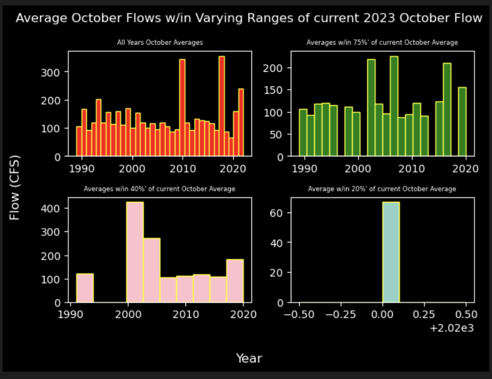

# Homework 7 - Plotting - Nathan Strom 

### Grade
3/3: Your plots are beautiful! I agree it does take a really long time to set them up especially at first but the good news is once you start getting a library of plots to start from it gets easier and easier.  

We will definitely get more practice with loops throughout the course. 
###

## Forecast Method Summary

The forecast prediction values I got were
* 1 week out: 99.098
* 2 weeks out: 106.814

This was found by taking the averages of October 1 - 14 2023. The averages of each Oct 1 - 14 time frame was taken for each year extending back to 1989. The years that included averages within +/- 40% of this years Oct 1 - 14 average were recorded into a dataframe. 

The years found from this procedure were then used to find the averages of the following 1 week out (Oct 15 - 21) and 2 weeks out (Oct 22 - 28). Any large outliers were filtered out of these averages. 

## Plot 1: Scatter Plot

* This plot is checking to see if there is any correlation between flow values in the first 2 weeks of October and the following 2 weeks. Data is from 1989 - 2022 October values. 

## Plot 2: Line Plot of Flow Trends in 2023

* Used to see the trends of flow this year (2023). 

## Plot 3: Historical Average Daily Flow in October

* Used to see general trend of flow across October. Outlier values have not been trimmed, and should be trimmed to get a better visual of average. 

## Plot 4: Prediction Averages Distributions w/ Varying Range Similarity to Oct 1 - 14 2023 Average Flow 

* Used to assess how taking an unweighted average depending on the selected range may be skewed by large flow values. 

## Plot 5: Min, Max, and Average Flow in October Across all years: 1989 - 2022

* Shows anomolies for each year and can be used to considered outlier data. 

## Favorite things you have learned or are feeling more confident about.
* I enjoy the plotting unit and being able to visually see my work. Learning plotting from scratch does a take a bit of time however, and getting the graphs to look aesthetically how I want can be a very timely manner, but I think the more I work with them, the more code I will have to build from, and the quicker suchs tasks will go. 
* I am very happy with pandas and numpy existing, they are very useful tools and really save time. 

## Things you are still confused/struggling with
* I could use more practice with loops. Although the various libraries we are learning have a lot of capabilities, I think becoming more proficient in written loops will save time when I still need to enter many lines of code manually. 