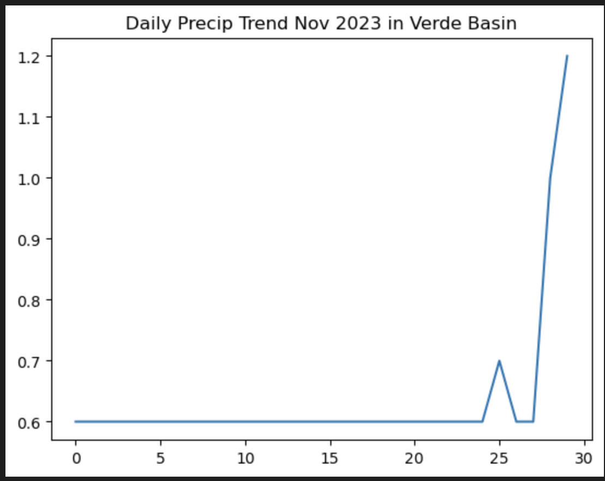
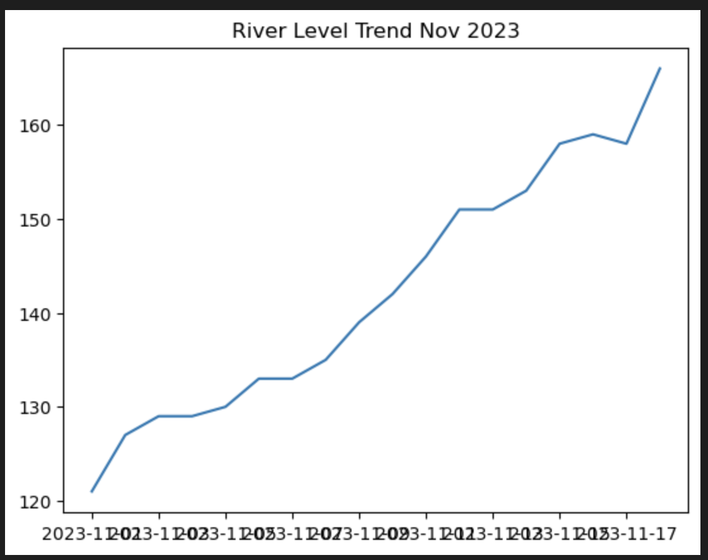

# WEEK 12 - APIs 

## Forecast Summary
- I generated the forecast by finding years with similar flow in the past 2 weeks. I set different changable selection factors which can filter you selection / range size and corrects the deviation of data that is included into the prediction. This was done in a function.

- I added a dataset which shows precipitation trends in the Verde basin. Sine this dataset a trend of precipitation this past week, this indicatess that a higher river gauge is likely to occur. I can use this data to consider whether my prediction value should be higher or lower than the one calculated from historical means with similar flow in the past two weeks. 

- Location: I chose the location 'Mormon Mountain' near Mormon Lake in AZ. I chose this data because of geographic location, relevence and ease of data, and accessibility. It was difficult finding accessible precipitation data for coding purposes that I knew how to incorporate. Therefore, I found a place that was within the Verde Basin and accessible / readibly useable for code. I found the code from the USDA's 'Air and Water Database' contained on their website.  
- Approach of access was to fill out condtions and inputs directly on the online interface of the data. Copy paste the URL, read in the URL, read in CSV file, use the skiplines method and identifying columns and datetimne. I would have liked to use a different method and used more relevent data, but I spent a lot of time digging around for data I could incorporate, and came up empty handed. 
## Graphs

- Plot from USDA precip data

- 2023 November Verde River Level
## Reflections
- It was very difficult finding relevent and accessible data that I could incorporate for this forecast, perhaps I just do not know where to look. I am not as confident with this unit, and found it less intuitive than the other units so far. Perhaps I just need to do a little more reading and practicing. Data and the all the nuiances can get confusing. 
