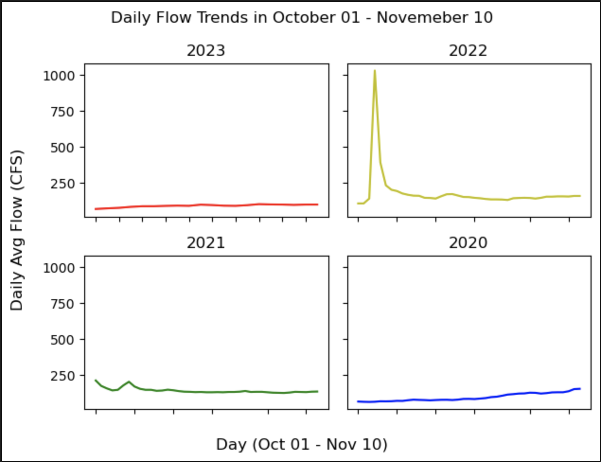

# WEEK 8: Python Skills -- Nathan Strom

## Forecast Predictions

- 1 week out: 99.0 cfs
- 2 weeks out: 104.4 cfs

### Forecast Prediction Method

From working with the flow data, I have realized this is a tricky year, as the river levels are abnormally low, and therefore I realized I should stop relying as heavily on previous year trends. 

I generated these predictions from matching years with similar averages, but this time I trimmed off abnormally large flows, then used a correction factor for the final calculation of this yield. The correction factor was the ratio of the actual flow average / my last weeks prediction using a similar technique of this method. This hopefully brings the value down to a more realistic prediction. 

### Graphs 

- This graph shows October through November 10th of flows in the current and past 3 years. This graph helps visualize trends in this period and confirm that this window of the current year as abnormally lower flow. 

- The red line is a plot of the averages in the date window shown in the graph title. The blue dots are the specific years I used to consider my average (their average flow of the 2 weeks before Oct 22 -28 was w/ in a 40% range of this years previous 2 weeks average). This graph helped me identify specific years with outliers that I should omit in my calculation for the flow prediction. 

### Weekly Reflection

This week has gone pretty well. Datetime was a bit confusing, not in the sense of utilizing it, but conceptualizing what it exactly is. It appears to be a built in functionality of python and other libraries and therefore it is not something you have to directly import at the top of the script. Regardless, I am glad I learned about datetime as a tool, as it makes plotting and selecting data much simpler. 

The difficulty of this class is the amount of content we have learned and can reference (which is also a good part of the class). I cannot do these assignments without referencing from the literature, but I suspect that virtually no one codes completely from the knowledge in their head. I am seeing why this class has "Tools" in the name, and obviously the point is to know what tools exist and where you can apply them (and not to completely memorize them all). Infact it would probably be a waste of time to focus on memorizing the majority of coding methods. I think the important part is knowning what functions you can use and how you can connect them to complete a desired task. 
